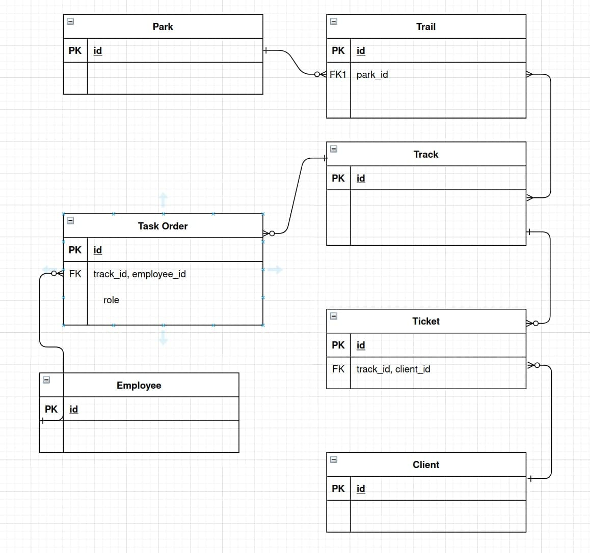

# Día 3

## Estructura de la base de datos

- Parque: id, nombre, horario, ciudad, latitud, longitud
- Sendero: id, nombre, estado (abierto/cerrado), dificultad (alta/media/baja)
- Ruta: id, fecha, duracion, ¿es privada?, longitud, plazas, modalidad (a pie, bicicleta, caballo, quad, todoterreno)
- Orden de trabajo: id, rol (principal, auxiliar)
- Empleado: id, nombre, apellidos, fecha de nacimiento, dni, teléfono, email, dirección, ¿está activo?
- Cliente: id, nombre, apellidos, fecha de nacimiento, dni, teléfono, email
- Entrada: id, fecha venta, coste

Notas:

1. Solo se incluyen atributos, no las relaciones.
1. Cliente y empleado son usuario y tendrán los atributos que les corresponda (usuario, clave y rol).

## Ejercicio: Crear las entidades con sus relaciones
